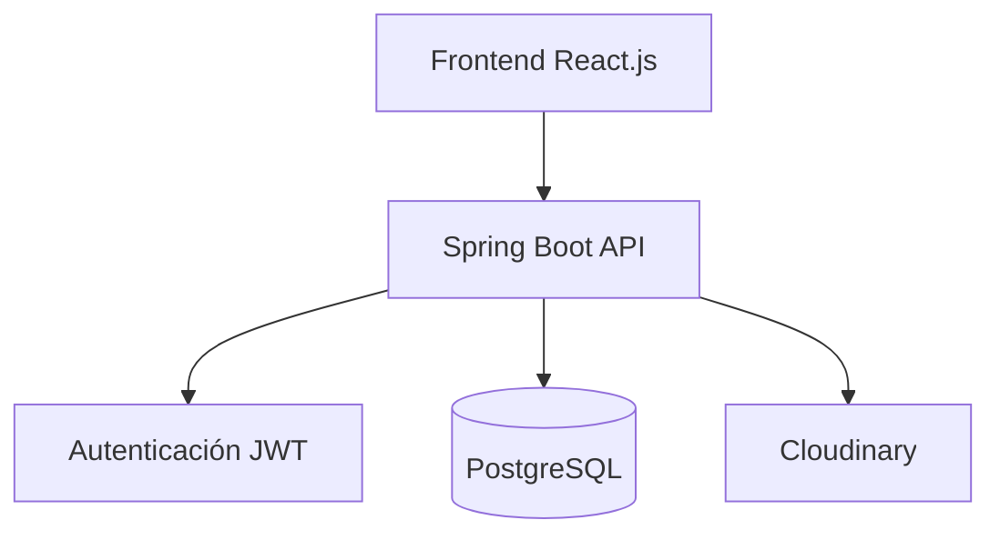

# 🎯 Visión General del Proyecto

*Tags: #backend #springboot #frontend #react #overview #galapass*

## 📋 Descripción del Proyecto

**Galapass** es una plataforma digital diseñada para la **creación, manejo y reserva de tours en Galápagos**.  
Cuenta con un **frontend en React.js** y un **backend en Spring Boot**, ofreciendo un sistema seguro y escalable para empresas, guías y turistas.

## 🎨 Contexto y Vista General

### 🏢 Organización del Proyecto

```
Galapass/
├── frontend/ # Aplicación React.js
└── backend/ # Aplicación Spring Boot (Este proyecto)
```


### 🌐 Propósito de la Plataforma
- **Creación de Tours**: Permitir a los propietarios registrar y publicar tours.
- **Gestión de Reservas**: Facilitar que los turistas puedan reservar y pagar tours.
- **Verificación de Identidad**: Validar credenciales de empresas, guías y turistas.
- **Control de Medios**: Manejo de imágenes y archivos en AWS S3.
- **Paneles Personalizados**: Interfaces específicas para propietarios, guías y turistas.

## 🏗️ Stack Tecnológico

### 🚀 Frameworks y Lenguajes
- **Frontend**: React.js
    - Hooks, Context API, React Router
    - Integración con API REST
    - `react-i18next` para internacionalización
- **Backend**: Spring Boot (Java 21)
    - Maven como sistema de construcción
    - Arquitectura modular por paquetes

### 🗄️ Base de Datos
- **PostgreSQL**
    - Soporte para datos relacionales y JSON
    - Integración con JPA/Hibernate

### 🔐 Autenticación y Autorización
- **Spring Security con JWT**
    - Autenticación stateless
    - Control de roles y permisos
- **OAuth2 con Google**
    - Registro e inicio de sesión con Google

### ☁️ Infraestructura
- **Cloudinary** para almacenamiento de imágenes
- **Render** para despliegue del backend
- **Docker y Docker Compose** para contenerización
- **Nginx** como proxy inverso con HTTPS (Certbot)

## 🎯 Características Principales

### ✨ Funcionalidades Core
- **Usuarios**
    - Registro con email o Google
    - Perfiles y roles (turista, guía, propietario)
    - Verificación de identidad
- **Tours**
    - Creación, edición y eliminación
    - Carga de imágenes y videos
    - Estado (próximos, activos, completados)
- **Reservas**
    - Filtrado por fechas y estado
    - Cancelaciones y reembolsos
- **Medios**
    - Subida y gestión de imágenes en cloudinary
- **Seguridad**
    - Autenticación JWT
    - Autorización por roles

### 🔧 Características Técnicas
- ✅ **API RESTful** clara y versionada
- ✅ **Manejo de excepciones centralizado**
- ✅ **Variables de entorno para configuración**
- ✅ **Internacionalización** (i18n)
- ✅ **Despliegue en Railway con PostgreSQL**
- [ ] **Cache con Redis** (planificado)
- [ ] **Notificaciones push** (planificado)

## 🏛️ Arquitectura de Alto Nivel



## 🌍 Entornos de Despliegue
### 🔧 Desarrollo (dev)
- **Frontend:** http://localhost:5173
- **Backend:** http://localhost:8080
- **Base de datos:** Local PostgreSQL
- **Logging:** DEBUG con SQL visible

### 🚀 Producción (prod)
- **Frontend:** https://galapass.netlify.app/
- **Base de datos:** PostgreSQL en Railway
- **Logging:** INFO, sin SQL en logs

## 📊 Estado del Proyecto
- **Endpoints API:** Completado
- **Integración Google OAuth2:** Activa
- **Subida de imágenes a Cloudinary:** Activa
- **Panel de Guía y Propietario:** En desarrollo

---
*Última actualización: 2025-08-14* 
*Versión del documento: 1.0*
